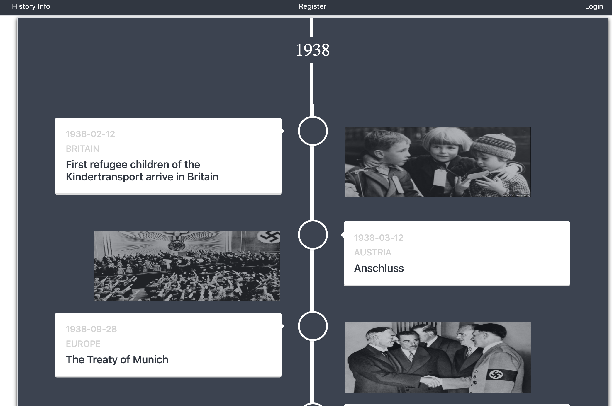

# SEI - Project 4 History Info
## Overview

The fourth project was to build a full-stack React application that comprises of a back-end and front-end, using Python.

Click to view the live version of the app --->
**[History Info](https://historysb.herokuapp.com/)**

---
### Timeframe

7 days

---


## Technical Requirements

You must:
* An ERD diagram showing relationships between models and a basic front-end wireframe/plan of how you will consume and display the data was required for sign off.
* The end-state must be a full-stack application making your own backend and your own front-end
* Use a PYTHON FLASK API to serve data from a PostgreSQL database
* Be a complete product which most likely means multiple relationships and CRUD functionality for at least a couple of models
* Be deployed online so it's publicly accessible.

---

## Technologies used

#### Front-end
* React
* Spectre - CSS Framework

#### Back-end

* Python
* Flask - for helping with the routes
* SQLAlchemy
* PostgreSQL - database

---

## The Approach

For my project I decided to create a history timeline where users could go to look at a specific period of history in detail. I decided to focus on WW2 history facts from the years of 1938 - 1945.

---

## User Journey

On the home page you will see the timeline presented with the dates.


When you click into a year, you can then see the full list of facts in date order including the location of the fact, and the headline.


When you click into the fact you then can expand the reading material and see the full photo. I seeded all the history facts in the back end and then used the Axios to make the request.

Once logged in users can comment and create their own facts which will appear in the timeline.

---

## Wins
I am very happy with the user experience of the app. One thing that was a win was realising that when the new facts are created they did not fall into the right date and year. Therefore I created a function so the fact would map through the years and be placed accordingly.

```
getYears() {
  axios.get('/api/years')
    .then(res => {
      const years = res.data.map(year => year.year)
      this.setState({ years })
    })
    .catch(err => console.log(err))
}
```

## Challenges

The main challenge when first starting the project was to figure out the model relationships. The next step would be to understand how the facts would be created inside the years. Therefore the models fell under, user, years and facts from here I was able to link them together.

## Future Improvements
With future improvements, I intend to add the following functionality:

* to add in other categories of history not just focusing on WW2 
